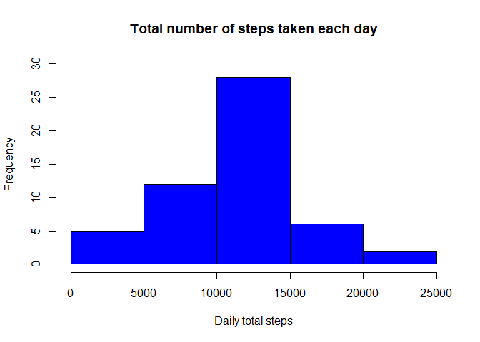
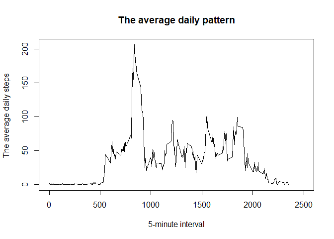
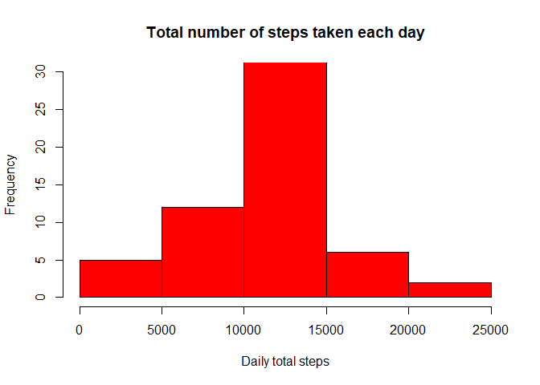
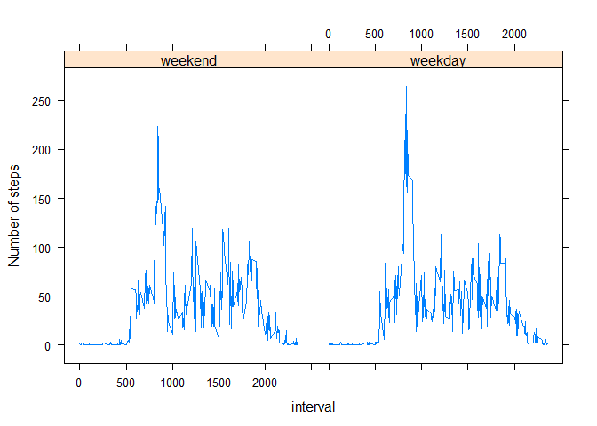

## Loading and preprocessing the data

```r
rm(list = ls())
setwd("C:/Users/Admin2/Desktop/Coursera/Reproducable_Research/Week2/RepData_PeerAssessment1")
unzip("activity.zip")
Activity.data<-read.csv("activity.csv", header = TRUE)
```

Caculating the mean total number of steps taken per day. The code below caculates the total number of steps taken per day,


```r
daily.total.steps<-aggregate(steps~date, Activity.data, sum, na.rm=TRUE)
```

Here is the table which shows the first few records of the total number of steps taken daily, 

```r
first.10.records<-head(daily.total.steps, n=10)
first.10.records
```

```
##          date steps
## 1  2012-10-02   126
## 2  2012-10-03 11352
## 3  2012-10-04 12116
## 4  2012-10-05 13294
## 5  2012-10-06 15420
## 6  2012-10-07 11015
## 7  2012-10-09 12811
## 8  2012-10-10  9900
## 9  2012-10-11 10304
## 10 2012-10-12 17382
```

We are going to plot a histogram of the total number of steps taken each day,

```r
hist(daily.total.steps$steps, main = "Total number of steps taken each day", xlab = "Daily total steps", col = "blue", ylim = c(0,30))
```

<!-- -->

The code below will calculate Mean and median of the total number of steps taken per day,

```r
my_mean <-round (mean(daily.total.steps$steps),2)
my_median<-round (median(daily.total.steps$steps),2)
```

The mean/average total number of steps taken per day was 1.076619\times 10^{4} steps, whilst the meadian was 1.0765\times 10^{4}.


##What is the average daily activity pattern?
The code below will make a time series plot of the 5-minute interval (x-axis) and the average number of steps taken, averaged across all days (y-axis)


```r
##create a seperate dataset
dta<-Activity.data
##Convert the interval to factor
dta$interval<-as.factor(dta$interval)
##Average the Steps across all days
dta.avg<-aggregate(steps~interval, dta, mean, na.rm=TRUE)
##convert the interval variable back to numeric
dta.avg$interval<-as.numeric(as.character(dta.avg$interval))
##Make the plot
plot(dta.avg$interval, dta.avg$steps, type ="l", main ="The average daily pattern", ylab="The average daily steps ", xlab="5-minute interval", xlim = c(0,2500))
```

<!-- -->

The code below extract the 5-minute interval with the maximum number of steps

```r
check.data<-dta.avg[dta.avg$steps==summary(dta.avg$steps)[[6]], ]
```

On average across all the days, the 835 is 5-minute interval with maximum number of steps of 206.17.

## Imputing missing values

Now we are calculating the total number of missing values in the dataset (i.e. the total number of rows)


```r
mytble<-table(is.na(Activity.data$steps))
tb_val<-as.numeric(mytble)
Na.prop<-round((tb_val[2]/nrow(Activity.data)) * 100,1)
```

Rows with missing data account for about  13.1% of the data, which is a total of 2304 rows of with NAs.

We will device a method of filling the missing data. The method will be to fill out the missing data with the average 5-minute interval,


```r
#Rename the columns of dta.avg
colnames(dta.avg)<-c("interval","AvgSteps")
#Merge the dataset and create a new set
MyMerged<-merge(Activity.data, dta.avg, by.x = "interval", by.y = "interval", all = FALSE)
#Replace the missing steps with the average
for (i in 1:nrow(MyMerged)){
  if (is.na(MyMerged$steps[i])){
    MyMerged$steps[i]<-MyMerged$AvgSteps[i]
  }
}
##Creating a new dataset that is equal to the original dataset but with the missing data filled in.
Activity.Complete<- subset(MyMerged, select = c(interval, steps, date))
```

Using the new dataset, we are going to create a histogram of the total number of steps taken each day. The code below does the procedure,


```r
#Aggregate the new dataset to get the total steps per data
ag.dta<-aggregate(steps~date, Activity.Complete, sum)
#Create the histogram
hist(ag.dta$steps, main = "Total number of steps taken each day", xlab = "Daily total steps", col = "red", ylim = c(0,30))
```

<!-- -->

We now go on to calculate the mean and median total number of steps taken per day using the complete dataset,


```r
my_mean1 <-round (mean(ag.dta$steps),2)
my_median1<-round (median(ag.dta$steps),2)
mean.diff <- my_mean - my_mean1
median.diff<- my_median - my_median1
```

From the calculation above, it shows that the mean is 1.076619\times 10^{4} and the meadian is 1.076619\times 10^{4}. The difference between the mean that was calculated with the data with missing cases and the data with no missing cases was 0 whilst the median was -1.19. This implied that the missng data impacted the the median, and the mean remain unchanged.

## Are there differences in activity patterns between weekdays and weekends?

Creating a new factor variable in the dataset with two levels – “weekday” and “weekend” indicating whether a given date is a weekday or weekend day.


```r
Activity.Complete$MyDate<-as.Date(as.character(Activity.Complete$date))

Activity.Complete$Weekday<-weekdays(Activity.Complete$MyDate, abbreviate=FALSE)

Activity.Complete$WKday<-ifelse(Activity.Complete$Weekday=="Sunday" | Activity.Complete$Weekday=="Saturday",1,0)

Activity.Complete$WKday<-factor(c(0,1), labels=c("weekend","weekday")) 
```

We are now going to make a panel plot containing a time series plot of the 5-minute interval and the average number of steps taken, averaged across all weekday days or weekend days.


```r
##Covert the interval variable to a factor
Activity.Complete$interval<-as.factor(Activity.Complete$interval)
##Average the steps
Week.Step.data<-aggregate(steps~WKday+interval, Activity.Complete, mean)
##Convert the interval back to numeric
Week.Step.data$interval<-as.numeric(as.character(Week.Step.data$interval))
##Make the time series plot
library(lattice)
xyplot(steps~interval | WKday, data = Week.Step.data, type = "l", ylab = "Number of steps")
```

<!-- -->


